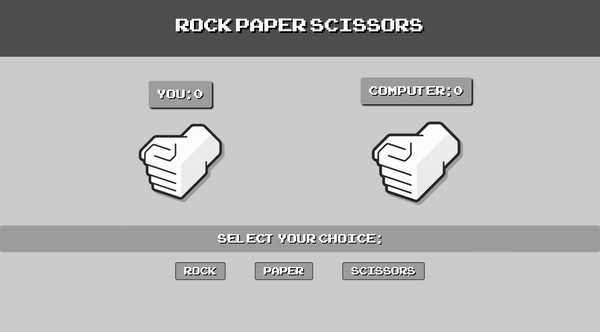

# Rock Paper Scissors

This was rock paper scissors, the [*3rd project*](https://www.theodinproject.com/lessons/foundations-rock-paper-scissors) within the Odin Project curriculum. This was an assignment designed to make students learn about the basics of DOM manipulation and events, and have a brief look into branching using Git.

In this rock paper scissors game, I applied my acquired JavaScript knowledge to create a rock paper scissors (RPS) game both to be played on the console and with a Graphical User Interface (GUI). I also implemented CSS animations to make the game more user-friendly and learnt about overlays to make delays in games. This assignment taught me about using event listeners in JavaScript too, which enabled me to add scoring to the project.

## Links

- [*Live Preview*](https://devvivan.github.io/odin-rock-paper-scissors/)
- [*My Progress*](https://github.com/DevVivan/odin-project)

## Images

{:height="50%" width="50%"}

